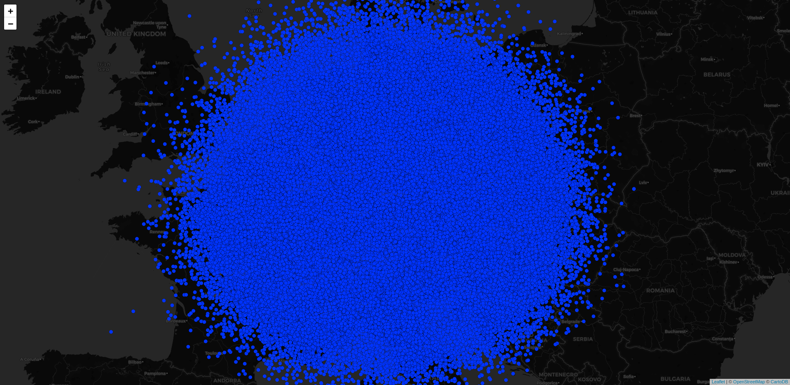
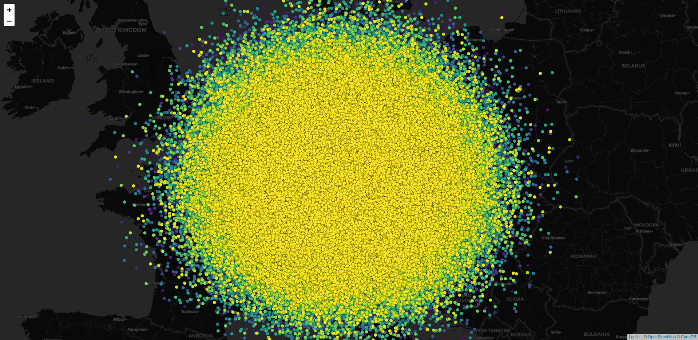
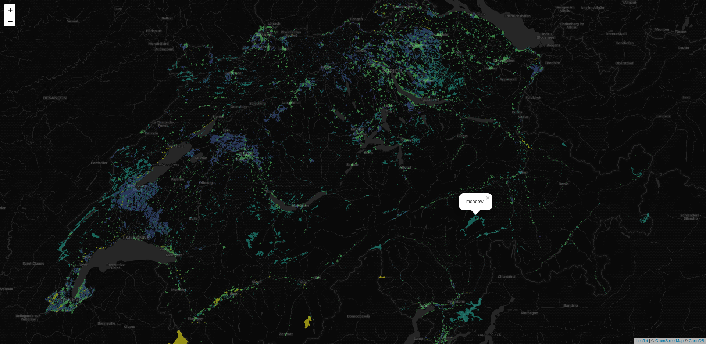

# leafgl

An R package for fast web gl rendering of features on leaflet maps.
It's an R port of https://github.com/robertleeplummerjr/Leaflet.glify where 
more detailed information/documentation can be found. Also, if you like 
what you get here, make sure to star the original repo!

-----

### Installation

Currently not on CRAN, github only:

```r
devtools::install_github("r-spatial/leafgl")
```

### What does it do?

It allows rendering of a large amount of features on a leaflet map. 
What exactly a "large amount" is, depends 

1. on the types of features and
2. on the hardware/software of the rendering machine. 

Regarding 1. millions of points should be no problem, but millions 
of polygons might, depending on their complexity - i.e. the number of 
vertices.

With regard to 2., obviously the amount of RAM will matter most but
there are other, more suptle, problems that can occur. 

Given it's name, leafgl is intended to fully integrate with the 
leaflet package, though it is very likely that it won't be a 1:1
replacement for the respective `leaflet::add*` functions. For example, 
given the intention to render/visualise as many features as possible we
need to make a compromise on what additional information we allow to be 
part of the rendering. So far, we allow coloring of features and popups
based on one column of the feature attributes, hence you cannot provide 
your own popup content. This may seem drastic, but all this information 
is costly both in terms of performance/speed and memory. In the end, who
wants to wait for a map that the browser isn't able to render anyway...

### What doesn't it do?

For starters, it doesn't guarantee to be working tomorrow. At this stage
lealet.glify is pre-alpha and under heavy development so things are 
likely to change frequently. For example, we are thinking about shorter 
funtion names (e.g. `addGlPolygons` instead of the current 
`addGlifyPolygons`). Additionally, we are still figuring out which 
pathway is best to use in order to pass data from R to the browser. As
a result, rendering environments other than the browser (or RStudio 
viewer) may not work properly or at all until we approach a more stable 
implementation.

#### NOTE

Depending on your operating system and browser, you may
see some weird colors that do not correspond to the ones that you
specified. The only known work-around at this stage is to set `opacity = 1`. 
For more details the inclined reader is referred to [this issue](https://github.com/tim-salabim/leafgl/issues/4)

### What can I do to help?

A lot! First and foremost you can use it as often as possible and report
issues/bugreports and/or feature request (see end of page for details). 
If you have ideas on how to enhance functionality without impacting
performance too much and feel confident enough to provide pull
request, please don't hesitate. Finally, if you have proficient 
knowledge of JavaScript and want/know how to improve the package in any 
way, we would very much love to hear from you!

### Example usage

#### 1 Mio. points on a map

This will render 1 Mio. points on a standard leaflet map. 

```r
library(mapview)
library(leaflet)
library(leafgl)
library(sf)

n = 1e6

df1 = data.frame(id = 1:n,
                 x = rnorm(n, 10, 3),
                 y = rnorm(n, 49, 1.8))

pts = st_as_sf(df1, coords = c("x", "y"), crs = 4326)

options(viewer = NULL) # view in browser

system.time({
  m = leaflet() %>%
    addProviderTiles(provider = providers$CartoDB.DarkMatter) %>%
    addGlifyPoints(data = pts, group = "pts") %>%
    addMouseCoordinates() %>%
    setView(lng = 10.5, lat = 49.5, zoom = 6) %>% 
    addLayersControl(overlayGroups = "pts")
})

m
```


<br>

-----

#### Colouring points by value mapping

For this we use `library(colourvalues)` because it can create color 
voctors in the blink of an eye!

```r
library(mapview)
library(leaflet)
library(leafgl)
library(sf)
library(colourvalues)

n = 1e6

df1 = data.frame(id = 1:n,
                 x = rnorm(n, 10, 3),
                 y = rnorm(n, 49, 1.8))

pts = st_as_sf(df1, coords = c("x", "y"), crs = 4326)

cols = colour_values_rgb(pts$id, include_alpha = FALSE) / 255

options(viewer = NULL)

system.time({
  m = leaflet() %>%
    addProviderTiles(provider = providers$CartoDB.DarkMatter) %>%
    addGlifyPoints(data = pts, color = cols, group = "pts") %>%
    addMouseCoordinates() %>%
    setView(lng = 10.5, lat = 49.5, zoom = 6) %>% 
    addLayersControl(overlayGroups = "pts")
})

m
```


<br>

-----

#### 100k polygons on a map

In reality, it only 97112 polygons... But who wants to be pedantic here?

This data was downloaded from https://download.geofabrik.de/europe/switzerland.html

```r
library(mapview)
library(leaflet)
library(leafgl)
library(sf)
library(colourvalues)

ch_lu = st_read("/media/timpanse/d8346522-ef28-4d63-9bf3-19fec6e13aab/bu_lenovo/software/testing/mapview/switzerland/landuse.shp")

ch_lu = ch_lu[, c(1, 3, 4)] # don't handle NAs so far

options(viewer = NULL)

cols = colour_values_rgb(ch_lu$type, include_alpha = FALSE) / 255

system.time({
  m = leaflet() %>%
    addProviderTiles(provider = providers$CartoDB.DarkMatter) %>%
    addGlifyPolygons(data = ch_lu, 
                     color = cols, 
                     popup = "type",
                     group = "pols") %>%
    addMouseCoordinates() %>%
    setView(lng = 8.3, lat = 46.85, zoom = 9) %>% 
    addLayersControl(overlayGroups = "pols")
})

m
```



<br>

-----

## Shiny ##

Thanks to [@ColinFay](https://github.com/ColinFay) `leafgl` has dedicated shiny functions. Given that what `leafgl` produces is a `leaflet` map, we only need to
use `leafglOutput` in our `ui` call. In the `server` call we can simply use `renderLeaflet`. Here an example:

```r
library(mapview)
library(leaflet)
library(leafgl)
library(sf)
library(shiny)

n = 1e6

df1 = data.frame(id = 1:n,
                 x = rnorm(n, 10, 3),
                 y = rnorm(n, 49, 1.8))

pts = st_as_sf(df1, coords = c("x", "y"), crs = 4326)

options(viewer = NULL) # view in browser

m = leaflet() %>%
  addProviderTiles(provider = providers$CartoDB.DarkMatter) %>%
  addGlPoints(data = pts, group = "pts") %>%
  addMouseCoordinates() %>%
  setView(lng = 10.5, lat = 49.5, zoom = 4) %>% 
  addLayersControl(overlayGroups = "pts")

ui <- fluidPage(
  leafglOutput("mymap")
)

server <- function(input, output, session) {
  output$mymap <- renderLeaflet(m)
}

shinyApp(ui, server)
```
<br>

-----


## Contact ##

Please file Pull requests, bug reports and feature requests at https://github.com/tim-salabim/leafgl/issues
